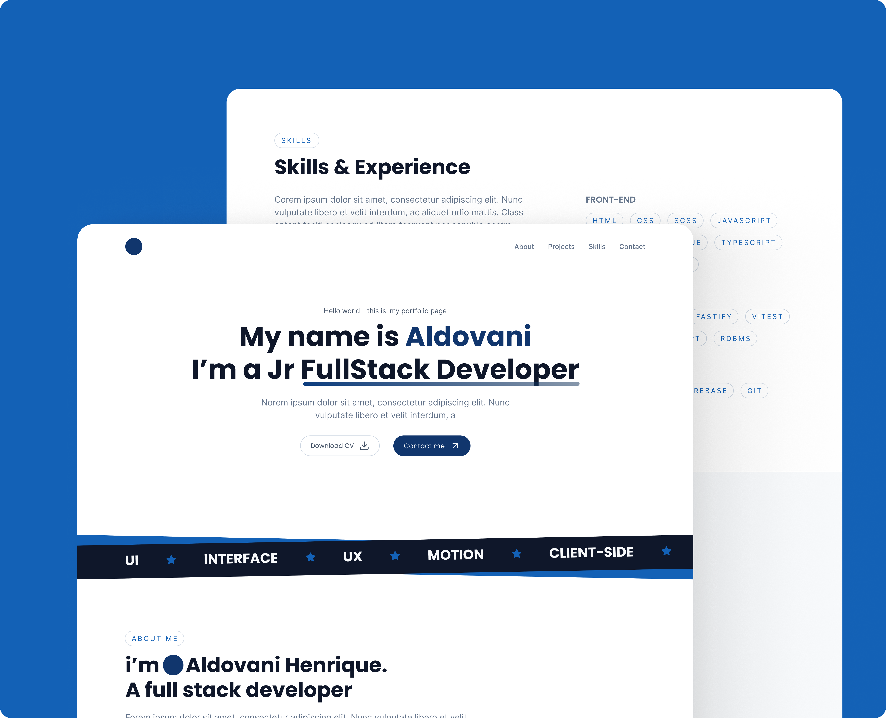

<h1> Portfolio</h1>

  <a href="#-tecnologias">Tecnologias</a>&nbsp;&nbsp;&nbsp;|&nbsp;&nbsp;&nbsp;
  <a href="#-projeto">Projeto</a>&nbsp;&nbsp;&nbsp;|&nbsp;&nbsp;&nbsp;
  <a href="#memo-licença">Licença</a>

 

  

## 🚀 Tecnologias

Esse projeto foi desenvolvido com as seguintes tecnologias:

- Html
- SASS
- JavaScript

## 💻 Projeto

O website é dividido em cinco seções. Inicialmente, a "Hero" proporciona uma breve apresentação sobre mim. Em seguida, a seção "Sobre Mim" oferece informações mais detalhadas sobre minha identidade e interesses. Posteriormente, na seção de "Projetos", destaco alguns dos meus principais trabalhos para proporcionar uma visão abrangente do meu portfólio. Continuando, a seção "Conhecimentos e Experiências" fornece uma análise mais profunda das minhas habilidades e experiências relevantes. Para encerrar, a seção "Contato" disponibiliza links para facilitar o contato direto comigo.

## 📝 Licença

Esse projeto está sob a licença MIT. Veja o arquivo [LICENSE](/license.md) para mais detalhes.

---

Feito com ♥ by Aldovani :wave: 
